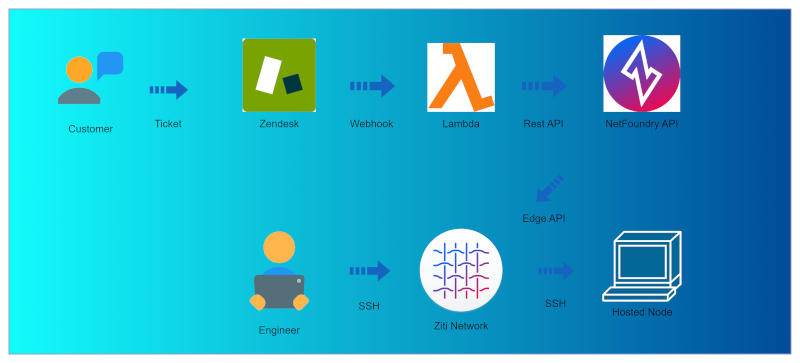
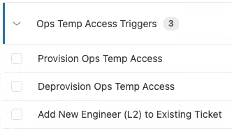
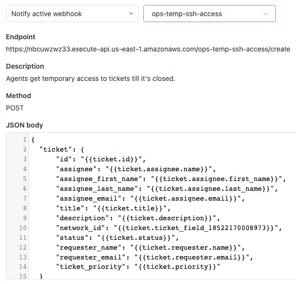
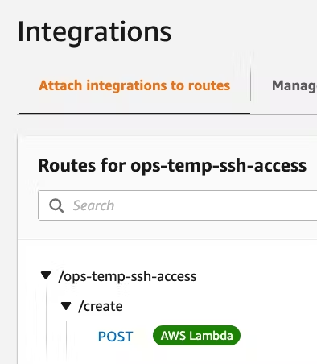
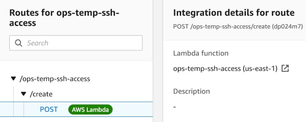

# Grant Temp Ziti Network Access for Support

## Purpose

The purpose of this repository is to show how we (Netfoundry) use the Ziti overlay network, ZenDesk, and AWS Lambda to provide operations team members with dynamic, privileged, and temporary access to customer endpoints. Ultimately, this is to adhere to a least privilege / zero-trust approach to access. In our case, ops team members should only have server access to customer resources when there is an express need - ie, during the lifetime of a support ticket/issue.  This is an evolution of our existing "dark bastion" configuration, which keeps the bastion jump server only accessible to those users with access authorized by the Ziti network. Whiel this is a working example, it is intended to be inspirational for others that may have a different mix of software, but want to implement business rule driven access to systems and information to achieve Zero Trust architecture goals.

## Architecture

A high level architecture of the flows and software invovled:

### Configure Zendesk Webhook

In this example, we are using ZenDesk to create and manage customer support tickets. The details will vary if using a different ticketing system, but the overall flow should be the same.

**Webhook Flows:**
1. Create/Provision Flow: When customer opens a new ticket, trigger the webhook with ticket status set to 'open'.

2. Delete/Deprovision Flow: When ticket is solved or closed, trigger the webhook with ticket_status set to 'solved'.

3. Update Flow: Assignee changes or adds a new assignee to existing ticket. This should trigger the webhook with ticket status set to 'assignee_changed'

The webhook should have three triggers or rules to achieve the above flows:

Webhook POST data should contain three required attributes:

1. The ticket assignee's email address

2. The unique customer Ziti network ID

3. The support ticket number

###  Webhook payload

## Configure AWS Gateway/Lambda to Receive Webhook

### Configure Lambda Functions

**Lambda: Authorizer Function**

NOTE: Details on the authorizer section are out of scope for this article. Essentially, this is needed to authorize the webhook request before allowing the request through. This gets attached to the API gateway route to enforce authorization in later section.

**Lambda: Temp Access Function (primary)**

This is the primary function that will receive the webhook, and provision resources in the Ziti network accordingly.

**Function Flow**

1. Check Ticket Status 'open|closed'

2. If ticket_status == open:

- Update Assignee's Entity in Bastions network with new endpoint attribute that contains the ticket ID.

- Lookup all customer host nodes using the network_id passed in the request

- Create a new service for each host, and set new service attribute that contains the ticket ID.

- Update AppWan/Policy with new endpoint/service attributes

3. If ticket_status == closed:

- Remove endpoint attribute for ticket in assignees endpoint attribute

- Remove services for ticket id

- Remove ticket specific attributes from AppWan

4. If ticket_status == assignee_changed:

- Update new Assignee's endpoint attributes (this will automatically grant access to the services via the existing appwan)

### Configure AWS Gateway

Configure Lambda Authorizer:

- Configure a primary route set to POST, and setup an integration with the Lambda function.

- Under 'Authorization' make sure to attach the route to your Lambda Authorizer

- Under 'Integrations' make sure to connect the route to the primary lambda function:

## Additional Reading

In this case, we make use of serverless functions, AWS Lambdas for various operations. You can also use OpenZiti IN AWS Lambda functions, using the python SDK or other offerings. One of our former interns at NetFoundry wrote a Lambda function to pass messages into our Ziti protected Mattermost instance, using the python SDK.

There are also "zitified" versions for ssh and scp, with the SDKs to operate on a Ziti network without the need for a tunneler client, depending on deployment wants or needs.
